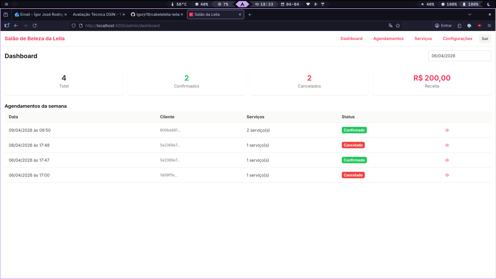

# Cabeleleila Leila — Sistema de Agendamentos



Sistema de agendamento online para salão de beleza, desenvolvido como teste técnico DSIN.

## Tecnologias

| Camada   | Stack                               |
| -------- | ----------------------------------- |
| Monorepo | pnpm workspaces                     |
| Backend  | NestJS 11 · TypeORM · PostgreSQL 16 |
| Frontend | Angular 19 · PrimeNG · PrimeFlex    |
| Infra    | Docker · Docker Compose · Nginx     |

---

## Execução com Docker _(recomendado)_

> **Pré-requisitos:** [Docker](https://docs.docker.com/get-docker/) + [Docker Compose](https://docs.docker.com/compose/install/) instalados e em execução.

```bash
# 1. Clone o repositório
git clone <url-do-repositorio>
cd cabeleleila-leila

# 2. Suba tudo com um único comando
docker compose up --build
```

Aguarde todos os containers ficarem saudáveis (**1–3 minutos na primeira vez** — o build compila API e frontend).

### URLs

| Serviço            | URL                              |
| ------------------ | -------------------------------- |
| **Aplicação web**  | <http://localhost:4200>          |
| **API REST**       | <http://localhost:3001>          |
| **Swagger / Docs** | <http://localhost:3001/api/docs> |

### Credenciais pré-cadastradas

| Perfil      | E-mail                           | Senha      |
| ----------- | -------------------------------- | ---------- |
| **Admin**   | `admin@leila.com`                | `admin123` |
| **Cliente** | cadastre-se via `/auth/register` | —          |

> O banco é populado automaticamente na primeira inicialização: estabelecimento, usuário admin e serviços são criados via seed.

### Parar os serviços

```bash
docker compose down       # para e remove os containers
docker compose down -v    # também apaga o volume do banco (dados zerados)
```

---

## Execução local _(desenvolvimento)_

### Pré-requisitos

- [Node.js](https://nodejs.org/) 22+
- [pnpm](https://pnpm.io/installation) 10+ — `npm install -g pnpm`
- [Docker](https://docs.docker.com/get-docker/) (apenas para o PostgreSQL)

### Passo a passo

```bash
# 1. Clone o repositório
git clone <url-do-repositorio>
cd cabeleleila-leila

# 2. Instale as dependências do monorepo
pnpm install

# 3. Suba apenas o banco de dados
docker compose up postgres -d

# 4. Configure as variáveis de ambiente da API
cp apps/api/.env.example apps/api/.env
# Os valores padrão já estão compatíveis com o postgres do docker compose acima.

# 5. Execute as migrações do banco
pnpm --filter api migration:run

# 6. Inicie API e frontend em terminais separados
pnpm dev:api   # → http://localhost:3001
pnpm dev:web   # → http://localhost:4200
```

O seed (admin + estabelecimento + serviços) executa automaticamente ao iniciar a API.

**Swagger disponível em:** <http://localhost:3001/api/docs>

---

## Estrutura do projeto

```
cabeleleila-leila/
├── apps/
│   ├── api/               # NestJS — Modular Monolith
│   │   ├── src/
│   │   │   ├── modules/   # auth · bookings · services · users · establishment
│   │   │   └── database/  # migrations · seeds · data-source
│   │   └── Dockerfile
│   └── web/               # Angular 19 — Mobile First
│       ├── src/
│       │   ├── app/
│       │   │   ├── core/      # serviços, interceptors, guards
│       │   │   ├── features/  # auth · bookings · services · admin · profile
│       │   │   ├── layout/    # main-layout · auth-layout
│       │   │   └── shared/    # pipes · utils
│       │   └── environments/
│       ├── Dockerfile
│       └── nginx.conf
├── packages/
│   └── contracts/         # Tipos e interfaces compartilhados entre API e Web
├── docs/
│   └── database.md        # ERD do banco de dados
├── docker-compose.yml
└── .dockerignore
```

---

## Funcionalidades

### Perfil Cliente

- Cadastro e login
- Visualizar catálogo de serviços disponíveis
- Criar agendamento com um ou mais serviços em uma única operação
- Sugestão automática de data quando já há agendamento na mesma semana
- Editar ou cancelar agendamento com prazo mínimo configurável (padrão: 2 dias)
- Histórico de agendamentos com filtros por status e período

### Perfil Admin

- Dashboard com estatísticas semanais: total, confirmados, cancelados e receita
- Gerenciar todos os agendamentos — alterar status diretamente na listagem
- Gerenciar catálogo de serviços (criar, editar, excluir)
- Configurar horário de funcionamento e prazo mínimo para alterações online

---

## Scripts disponíveis

```bash
# Desenvolvimento
pnpm dev:api                          # API em modo watch
pnpm dev:web                          # Frontend em modo watch

# Build
pnpm build:api                        # Build de produção da API
pnpm build:web                        # Build de produção do frontend

# Testes e qualidade
pnpm test:api                         # Testes da API
pnpm lint:api                         # Lint da API
pnpm lint:web                         # Lint do frontend

# Migrações do banco
pnpm --filter api migration:run       # Aplica migrações pendentes
pnpm --filter api migration:revert    # Reverte a última migração
pnpm --filter api migration:generate  # Gera nova migração a partir das entidades
```

---

## Screenshots

Veja mais capturas de tela da aplicação na pasta [docs/screenshots/](docs/screenshots/).

---

## Troubleshooting

**Porta já em uso**

```bash
# Verifique qual processo está usando a porta e encerre-o, ou altere as portas no docker-compose.yml
lsof -i :4200
lsof -i :3001
lsof -i :5432
```

**Container da API reiniciando em loop**

```bash
# Veja os logs para identificar o erro
docker compose logs api
```

Causa mais comum: o banco ainda não estava pronto quando a API subiu. Aguarde o healthcheck do postgres passar e reinicie:

```bash
docker compose restart api
```

**Dados inconsistentes / quero recomeçar do zero**

```bash
docker compose down -v   # remove containers E o volume do banco
docker compose up --build
```

**Build falhou por falta de memória**

Aumente a memória disponível para o Docker Desktop (recomendado: 4 GB+) nas configurações de recursos.
